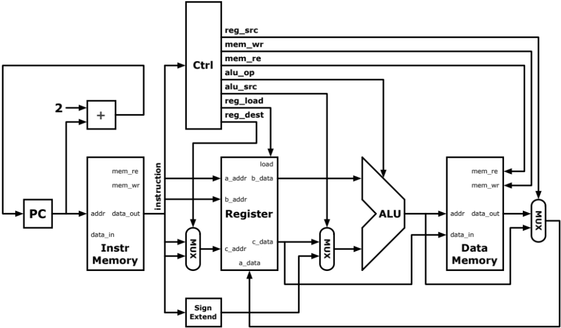
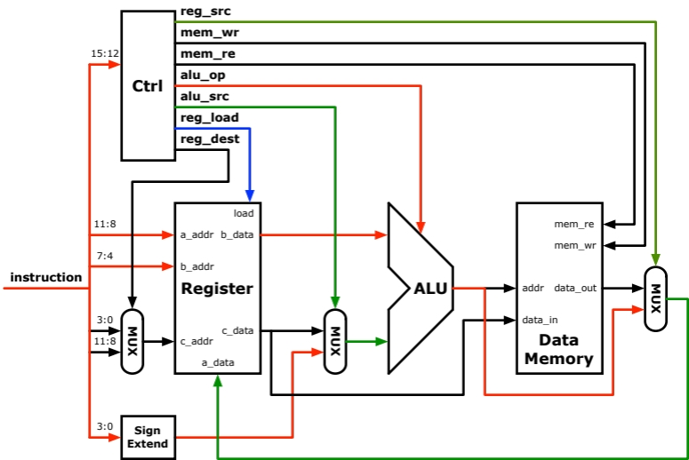
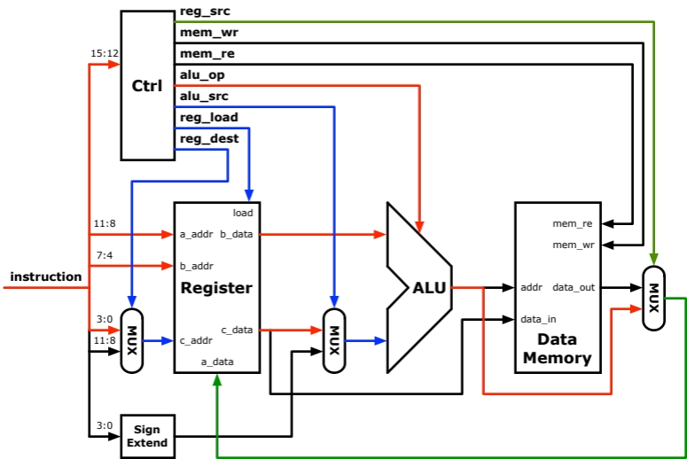
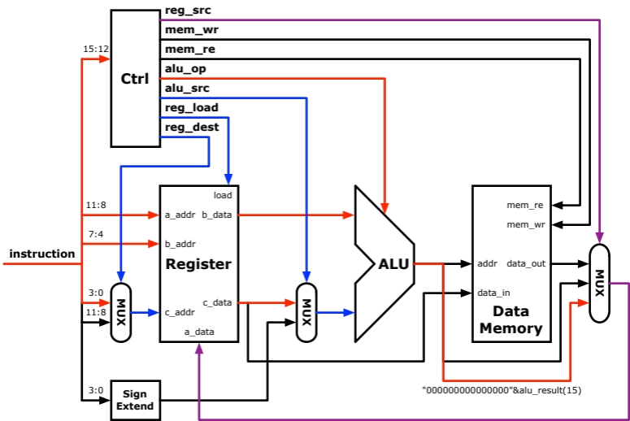
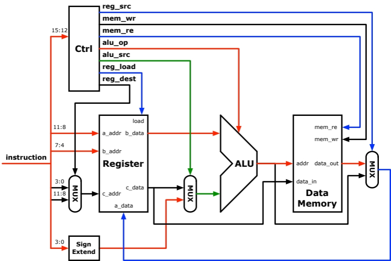
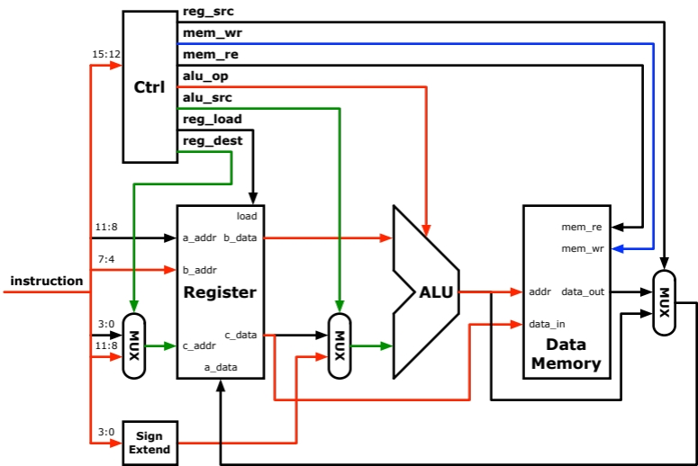
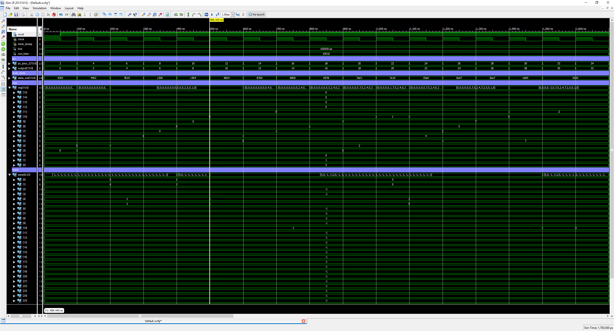

# basic-cpu
A basic MIPS-like single cycle CPU in VHDL

## Full Diagram

## I Type Instruction

## R Type Instruction

## SLT Instruction

## LW Instruction

## SW Instruction

## Test Results
| Instruction      | op | r_d | r_s | r_t/immediate | Value (r_d)                        |
| ---------------- | -- | --- | --- | ------------- | ---------------------------------- |
| ADDI R3, R0, 5   | 4  | 3   | 0   | 5             | 5                                  |
| ADDI R4, R0, 2   | 4  | 4   | 0   | 2             | 2                                  |
| SLT R11, R3,R4   | 7  | B   | 3   | 4             | 0                                  |
| SW R3, 0(R0)     | C  | 3   | 0   | 0             | M[0] = 5   Value of R3 = 5     |
| SW R4, 4(R0)     | C  | 4   | 0   | 4             | M[4] = 2   Value of R4 = 4     |
| ADDI R6, R0, 4   | 4  | 6   | 0   | 4             | 4                                  |
| LW R7, 0(R6)     | 8  | 7   | 6   | 0             | Value of R7 = 2   M[4] = 2     |
| LW R8, 0(R0)     | 8  | 8   | 0   | 0             | Value of R8 = 5   M[0] = 5     |
| ADD R9, R7, R8   | 0  | 9   | 7   | 8             | 7                                  |
| SLT R10, R0,R1   | 7  | A   | 0   | 1             | 1                                  |
| SLT R10, R1,R0   | 7  | A   | 1   | 0             | 0                                  |
| OR R5, R10, R9   | 3  | 5   | A   | 9             | 7                                  |
| SUBI R10, R5, 7  | 5  | A   | 5   | 7             | 0                                  |
| SUB R11, R10, R7 | 1  | B   | A   | 7             | \-2                                |
| SW R11, 5(R8)    | C  | B   | 8   | 5             | M[10] = -2   Value of R11 = -2 |

